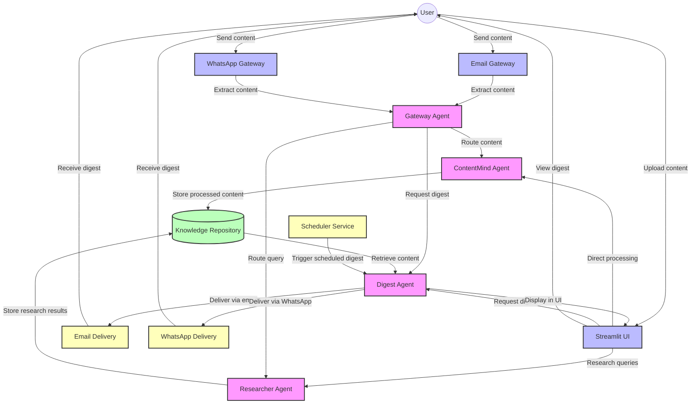
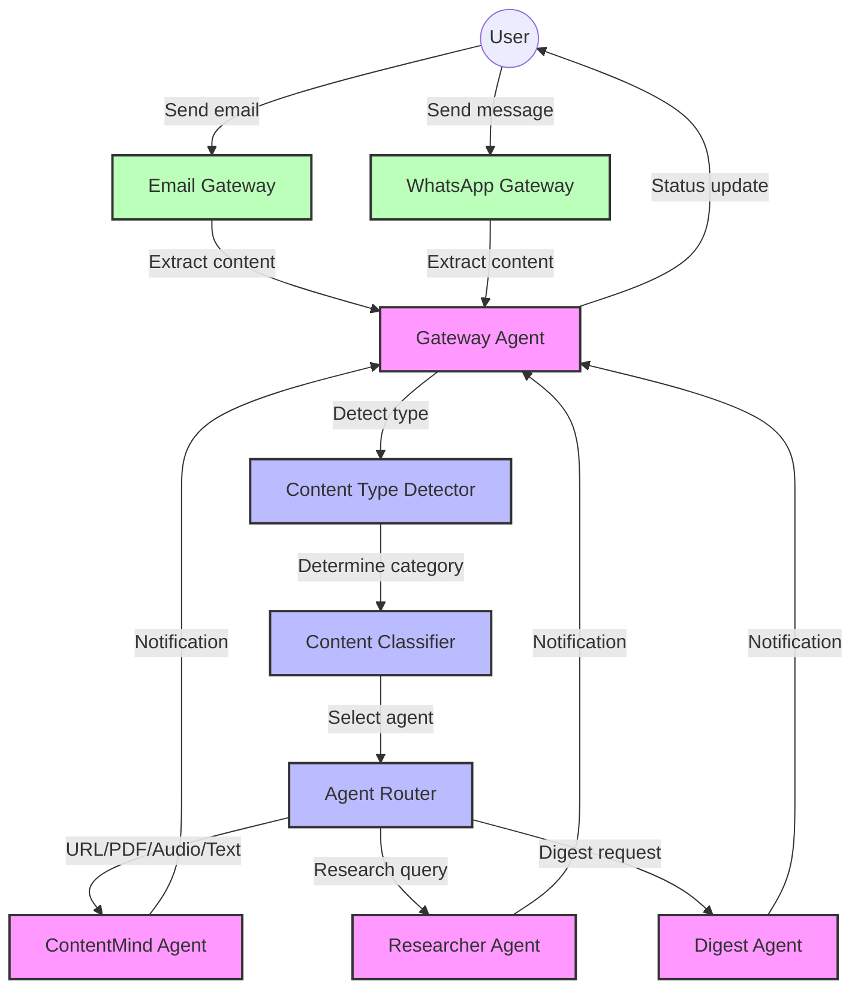
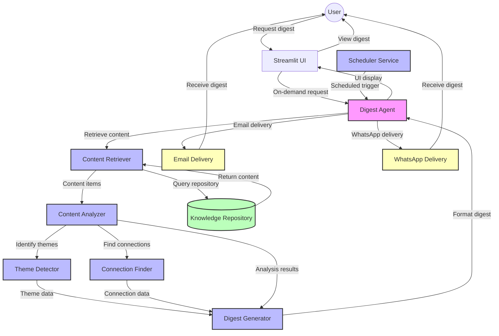
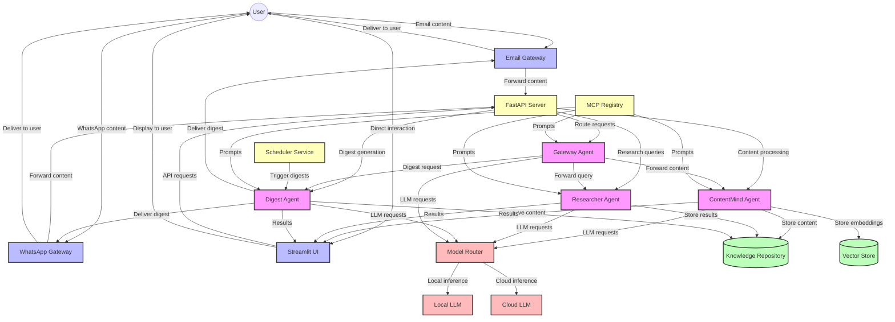

# Bluelabel AIOS Complete Workflow Diagram

## Content Submission to Digest Workflow

```mermaid
graph TD
    %% Define nodes
    User((User))
    Email[Email Gateway]
    WhatsApp[WhatsApp Gateway]
    UI[Streamlit UI]
    Gateway[Gateway Agent]
    ContentMind[ContentMind Agent]
    Researcher[Researcher Agent]
    Repository[(Knowledge Repository)]
    Digest[Digest Agent]
    Scheduler[Scheduler Service]
    DigestEmail[Email Delivery]
    DigestWhatsApp[WhatsApp Delivery]
    
    %% Define styles
    classDef agent fill:#f9f,stroke:#333,stroke-width:2px;
    classDef gateway fill:#bbf,stroke:#333,stroke-width:2px;
    classDef storage fill:#bfb,stroke:#333,stroke-width:2px;
    classDef delivery fill:#ffb,stroke:#333,stroke-width:2px;
    
    %% Apply styles
    class ContentMind,Researcher,Gateway,Digest agent;
    class Email,WhatsApp,UI gateway;
    class Repository storage;
    class DigestEmail,DigestWhatsApp,Scheduler delivery;
    
    %% Define flow
    %% Content submission paths
    User -->|Send content| Email
    User -->|Send content| WhatsApp
    User -->|Upload content| UI
    
    %% Gateway processing
    Email -->|Extract content| Gateway
    WhatsApp -->|Extract content| Gateway
    UI -->|Direct processing| ContentMind
    UI -->|Research queries| Researcher
    UI -->|Request digest| Digest
    
    %% Content routing
    Gateway -->|Route content| ContentMind
    Gateway -->|Route query| Researcher
    Gateway -->|Request digest| Digest
    
    %% Content processing
    ContentMind -->|Store processed content| Repository
    Researcher -->|Store research results| Repository
    
    %% Digest creation
    Repository -->|Retrieve content| Digest
    Scheduler -->|Trigger scheduled digest| Digest
    
    %% Digest delivery
    Digest -->|Deliver via email| DigestEmail
    Digest -->|Deliver via WhatsApp| DigestWhatsApp
    Digest -->|Display in UI| UI
    
    %% Return path
    DigestEmail -->|Receive digest| User
    DigestWhatsApp -->|Receive digest| User
    UI -->|View digest| User
```

## Detailed Gateway Agent Workflow

```mermaid
graph TD
    %% Define nodes
    User((User))
    Email[Email Gateway]
    WhatsApp[WhatsApp Gateway]
    Gateway[Gateway Agent]
    Detector[Content Type Detector]
    Classifier[Content Classifier]
    Router[Agent Router]
    ContentMind[ContentMind Agent]
    Researcher[Researcher Agent]
    Digest[Digest Agent]
    
    %% Define styles
    classDef agent fill:#f9f,stroke:#333,stroke-width:2px;
    classDef component fill:#bbf,stroke:#333,stroke-width:2px;
    classDef gateway fill:#bfb,stroke:#333,stroke-width:2px;
    
    %% Apply styles
    class ContentMind,Researcher,Gateway,Digest agent;
    class Detector,Classifier,Router component;
    class Email,WhatsApp gateway;
    
    %% Define flow
    User -->|Send email| Email
    User -->|Send message| WhatsApp
    
    %% Gateway processing
    Email -->|Extract content| Gateway
    WhatsApp -->|Extract content| Gateway
    
    %% Content analysis
    Gateway -->|Detect type| Detector
    Detector -->|Determine category| Classifier
    Classifier -->|Select agent| Router
    
    %% Content routing
    Router -->|URL/PDF/Audio/Text| ContentMind
    Router -->|Research query| Researcher
    Router -->|Digest request| Digest
    
    %% Feedback path
    ContentMind -->|Notification| Gateway
    Researcher -->|Notification| Gateway
    Digest -->|Notification| Gateway
    Gateway -->|Status update| User
```

## Detailed Digest Agent Workflow

```mermaid
graph TD
    %% Define nodes
    User((User))
    UI[Streamlit UI]
    Scheduler[Scheduler Service]
    Digest[Digest Agent]
    Retriever[Content Retriever]
    Analyzer[Content Analyzer]
    ThemeDetector[Theme Detector]
    ConnectionFinder[Connection Finder]
    Generator[Digest Generator]
    Repository[(Knowledge Repository)]
    EmailDelivery[Email Delivery]
    WhatsAppDelivery[WhatsApp Delivery]
    
    %% Define styles
    classDef agent fill:#f9f,stroke:#333,stroke-width:2px;
    classDef component fill:#bbf,stroke:#333,stroke-width:2px;
    classDef storage fill:#bfb,stroke:#333,stroke-width:2px;
    classDef delivery fill:#ffb,stroke:#333,stroke-width:2px;
    
    %% Apply styles
    class Digest agent;
    class Retriever,Analyzer,ThemeDetector,ConnectionFinder,Generator,Scheduler component;
    class Repository storage;
    class EmailDelivery,WhatsAppDelivery delivery;
    
    %% Define flow
    %% Digest request paths
    User -->|Request digest| UI
    UI -->|On-demand request| Digest
    Scheduler -->|Scheduled trigger| Digest
    
    %% Digest processing
    Digest -->|Retrieve content| Retriever
    Retriever -->|Query repository| Repository
    Repository -->|Return content| Retriever
    Retriever -->|Content items| Analyzer
    
    %% Content analysis
    Analyzer -->|Identify themes| ThemeDetector
    Analyzer -->|Find connections| ConnectionFinder
    ThemeDetector -->|Theme data| Generator
    ConnectionFinder -->|Connection data| Generator
    Analyzer -->|Analysis results| Generator
    
    %% Digest creation and delivery
    Generator -->|Format digest| Digest
    Digest -->|Email delivery| EmailDelivery
    Digest -->|WhatsApp delivery| WhatsAppDelivery
    Digest -->|UI display| UI
    
    %% Return path
    EmailDelivery -->|Receive digest| User
    WhatsAppDelivery -->|Receive digest| User
    UI -->|View digest| User
```

## Complete System Architecture

```mermaid
graph TD
    %% Define nodes
    User((User))
    EmailGW[Email Gateway]
    WhatsAppGW[WhatsApp Gateway]
    UI[Streamlit UI]
    APIServer[FastAPI Server]
    GatewayAgent[Gateway Agent]
    ContentMindAgent[ContentMind Agent]
    ResearcherAgent[Researcher Agent]
    DigestAgent[Digest Agent]
    ModelRouter[Model Router]
    LocalLLM[Local LLM]
    CloudLLM[Cloud LLM]
    KnowledgeRepo[(Knowledge Repository)]
    VectorStore[(Vector Store)]
    SchedulerService[Scheduler Service]
    MCPRegistry[MCP Registry]
    
    %% Define styles
    classDef agent fill:#f9f,stroke:#333,stroke-width:2px;
    classDef gateway fill:#bbf,stroke:#333,stroke-width:2px;
    classDef storage fill:#bfb,stroke:#333,stroke-width:2px;
    classDef service fill:#ffb,stroke:#333,stroke-width:2px;
    classDef llm fill:#fbb,stroke:#333,stroke-width:2px;
    
    %% Apply styles
    class GatewayAgent,ContentMindAgent,ResearcherAgent,DigestAgent agent;
    class EmailGW,WhatsAppGW,UI gateway;
    class KnowledgeRepo,VectorStore storage;
    class APIServer,SchedulerService,MCPRegistry service;
    class LocalLLM,CloudLLM,ModelRouter llm;
    
    %% Define flow
    %% User interaction paths
    User -->|Email content| EmailGW
    User -->|WhatsApp content| WhatsAppGW
    User -->|Direct interaction| UI
    
    %% Frontend to backend
    EmailGW -->|Forward content| APIServer
    WhatsAppGW -->|Forward content| APIServer
    UI -->|API requests| APIServer
    
    %% API server to agents
    APIServer -->|Route requests| GatewayAgent
    APIServer -->|Content processing| ContentMindAgent
    APIServer -->|Research queries| ResearcherAgent
    APIServer -->|Digest generation| DigestAgent
    
    %% Agent interactions
    GatewayAgent -->|Forward content| ContentMindAgent
    GatewayAgent -->|Forward query| ResearcherAgent
    GatewayAgent -->|Digest request| DigestAgent
    
    %% Agent to supporting services
    ContentMindAgent -->|Store content| KnowledgeRepo
    ContentMindAgent -->|Store embeddings| VectorStore
    ResearcherAgent -->|Store results| KnowledgeRepo
    DigestAgent -->|Retrieve content| KnowledgeRepo
    
    %% LLM integration
    ContentMindAgent -->|LLM requests| ModelRouter
    ResearcherAgent -->|LLM requests| ModelRouter
    DigestAgent -->|LLM requests| ModelRouter
    GatewayAgent -->|LLM requests| ModelRouter
    
    %% Model routing
    ModelRouter -->|Local inference| LocalLLM
    ModelRouter -->|Cloud inference| CloudLLM
    
    %% Scheduler integration
    SchedulerService -->|Trigger digests| DigestAgent
    
    %% MCP integration
    MCPRegistry -->|Prompts| ContentMindAgent
    MCPRegistry -->|Prompts| ResearcherAgent 
    MCPRegistry -->|Prompts| DigestAgent
    MCPRegistry -->|Prompts| GatewayAgent
    
    %% Return path
    DigestAgent -->|Deliver digest| EmailGW
    DigestAgent -->|Deliver digest| WhatsAppGW
    ContentMindAgent -->|Results| UI
    ResearcherAgent -->|Results| UI
    DigestAgent -->|Results| UI
    
    EmailGW -->|Deliver to user| User
    WhatsAppGW -->|Deliver to user| User
    UI -->|Display to user| User
```